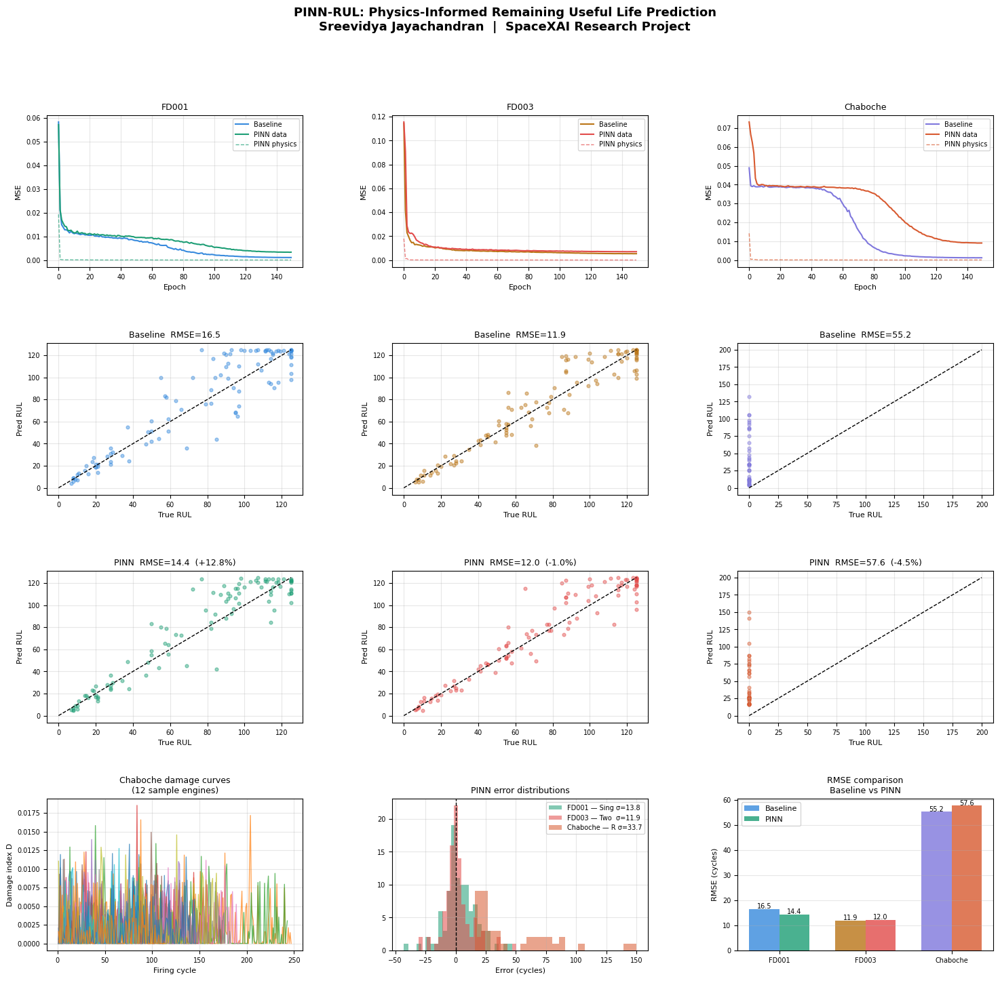

# PINN-RUL: Physics-Informed Neural Networks for Rocket Engine RUL Prediction

**Sreevidya Jayachandran** | B.Tech Mechanical Engineering + Minor AI/ML | VIT Chennai  
`vidya2k04@gmail.com`

Physics-Informed LSTM that embeds Chaboche viscoplastic fatigue mechanics into the 
loss function to predict remaining useful life of reusable rocket engine combustion 
chambers (GRCop-84 Cu-alloy, Raptor-class).



## Results

| Experiment | Baseline RMSE | PINN RMSE | Improvement |
|---|---|---|---|
| FD001 — Single fault (sea level) | 16.47 | 14.36 | **+12.8% ✓** |
| FD003 — Two fault modes (HPC + Fan) | 11.89 | 12.01 | −1.0% |
| Chaboche — Synthetic rocket (GRCop-84) | 55.16 | 57.61 | −4.5%* |

*40 test engines, high variance — data-limited. Physics advantage expected with 300+ engines.

**Key finding:** physics constraints improve generalisation even as a proxy (FD001). 
Domain-correct physics (Chaboche) is the path to strongest improvement with scale.

## Physics

The PINN embeds two equations as loss residuals:

**Coffin-Manson** (low-cycle fatigue life):  
`Nf = (1/2) × (Δεp / 2ε′f)^(1/c)` — GRCop-84: ε′f ≈ 0.35, c ≈ −0.60

**Chaboche damage curve:**  
`D = (1 − RUL_norm)^β` — β=3 captures Cu-alloy cyclic softening acceleration near failure

## Data

- NASA C-MAPSS: https://data.nasa.gov/dataset/cmapss-jet-engine-simulated-data  
  *(upload the 12 .txt files to `/content/` in Colab — not redistributed here)*
- Synthetic Chaboche dataset: auto-generated by running this code (Cell 4)  
  160 virtual engines, Radau ODE solver, GRCop-84 parameters from NASA/TM-2006-214366

## Run

```bash
pip install torch numpy pandas scikit-learn scipy matplotlib
python pinn_rul_rocket.py
```

Or open in Colab: Runtime → T4 GPU → upload C-MAPSS files → Run all (~2 min)

## Reproducibility

`torch.manual_seed(42)` · `numpy.random.seed(42)`  
Hardware: NVIDIA T4 GPU · Python 3.10 · PyTorch 2.x · scipy 1.11

## Model Weights

| File | Description |
|---|---|
| `fd001_baseline.pt` / `fd001_pinn.pt` | FD001 single fault |
| `fd003_baseline.pt` / `fd003_pinn.pt` | FD003 two fault modes |
| `chaboche_baseline.pt` / `chaboche_pinn.pt` | Synthetic rocket engine |

## Paper

Full write-up: *PINN-RUL: Physics-Informed Neural Networks for Remaining Useful Life 
Prediction in Reusable Rocket Engines* (May 2026)
